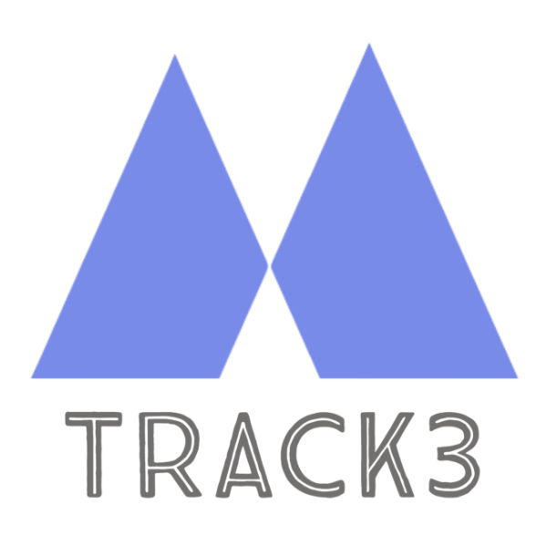
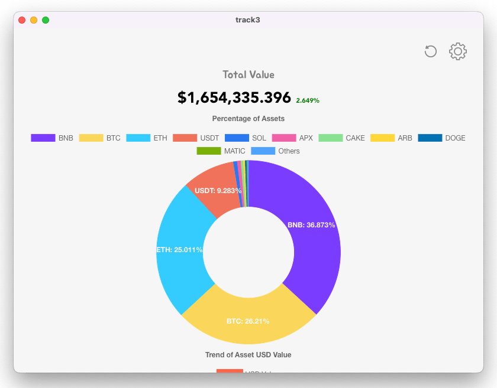
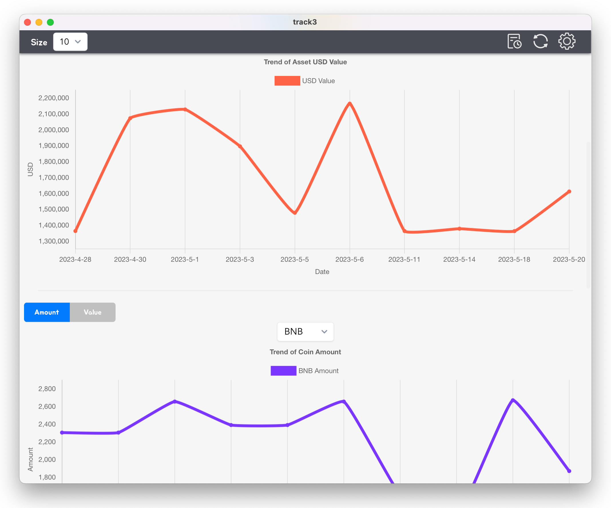

    

<h1 align="center">Track3</h1>

### Analyze your crypto assets on centralized exchanges and web3 wallets

[![author][author-image]][author-url]
[![license][license-image]][license-url]
[![release][release-image]][release-url]
[![last commit][last-commit-image]][last-commit-url]

[author-image]: https://img.shields.io/badge/author-domechn-blue.svg
[author-url]: https://github.com/domechn
[license-image]: https://img.shields.io/github/license/domechn/track3?color=blue
[license-url]: https://github.com/domechn/track3/blob/main/LICENSE
[release-image]: https://img.shields.io/github/v/release/domechn/track3?color=blue
[release-url]: https://github.com/domechn/track3/releases/latest
[last-commit-image]: https://img.shields.io/github/last-commit/domechn/track3?label=last%20commit
[last-commit-url]: https://github.com/domechn/track3/commits

## Features

1. **No backend server, all data is stored locally by default**
2. Support Binance and OKX. How to create api key: [Binance](https://www.binance.com/en-BH/support/faq/how-to-create-api-360002502072), [OKX](https://use.autoview.com/hc/en-us/articles/360004576632-OKEx-Creating-an-API)
3. Support BTC, SOL, Doge and all ERC20 Tokens.
4. Render a visual chart of asset changes or the proportion of each asset.
5. Support Cloud Sync, users can sync their data to cloud and restore it on another device.

## Installation

[Download In Release Page](https://github.com/domechn/track3/releases)

## Screenshots

## Cloud Sync

Track3 use [Polybase](https://polybase.xyz/) to sync data. Polybase is a decentralized database powered by zero knowledge proofs, with attributes of a blockchain and the speed & privacy of a database.

### Notice

**All your data is private, only you can access it. And track3 will never sync your configurations into cloud, they are always stored locally with encryption. So your wallet addresses and api keys are totally safe.**

But currently track3 are using polybase testnet, so your data may be lost on cloud, but this will not affect your local data.

## Known Issues

- [ ] Cannot list assets in earn wallet in OKX
- [ ] Cannot list assets in Launchpool in Binance

## Sponsor

- Use this [referral link](https://accounts.binance.com/register?ref=123810997) to register on Binance, both you and i will get 20% discount on trading fees or reward.
- Use this [referral link](https://www.okx.com/join/7161626) to register on OKX, both you and i will get mystery boxes.

## Thanks

Thanks for these platform who provide powerful APIs without API Key. Fuck API Key.

- https://blockchain.info
- https://blockcypher.com
- https://dogechain.info
- https://debank.com
- ~~https://solscan.io~~ https://phantom.app
- https://coingecko.com
- https://exchangerate.host
