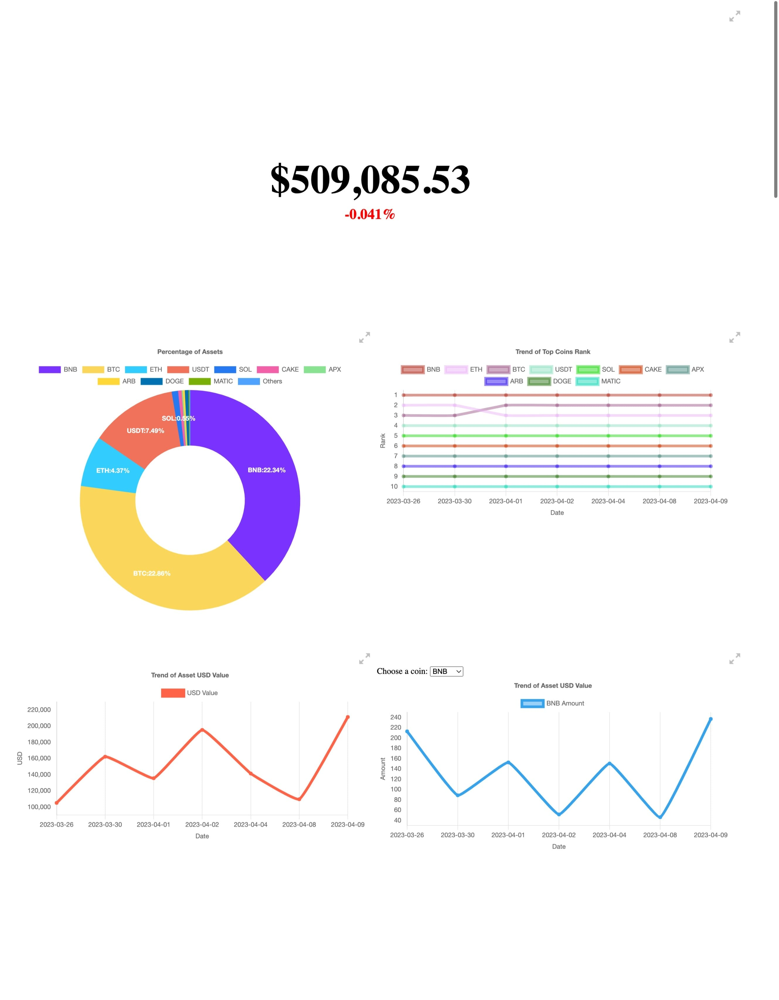

# Track3

Show your crypto currency assets in centralized exchanges and web3 wallets.

## Features

1. Support all CEX supported by [cctx](https://github.com/ccxt/ccxt)
2. Support BTC, SOL, Doge and all ERC20 Tokens
3. Export all data to Notion Database or CSV file
4. Render a visual chart of asset changes or the proportion of each asset

## Installation

TODO

## Output

[Online Demo](https://asset-statistics-pages.vercel.app/mocked/index.html)

## Known Issues

- [ ] Cannot list assets in earn wallet in OKX
- [ ] Cannot list assets in Launchpool in Binance

## Thanks

Thanks for these platform who provide powerful APIs without API Key. Fuck API Key.

- https://blockchain.info
- https://blockcypher.com
- https://dogechain.info
- https://debank.com
- https://solscan.io
- https://coingecko.com
