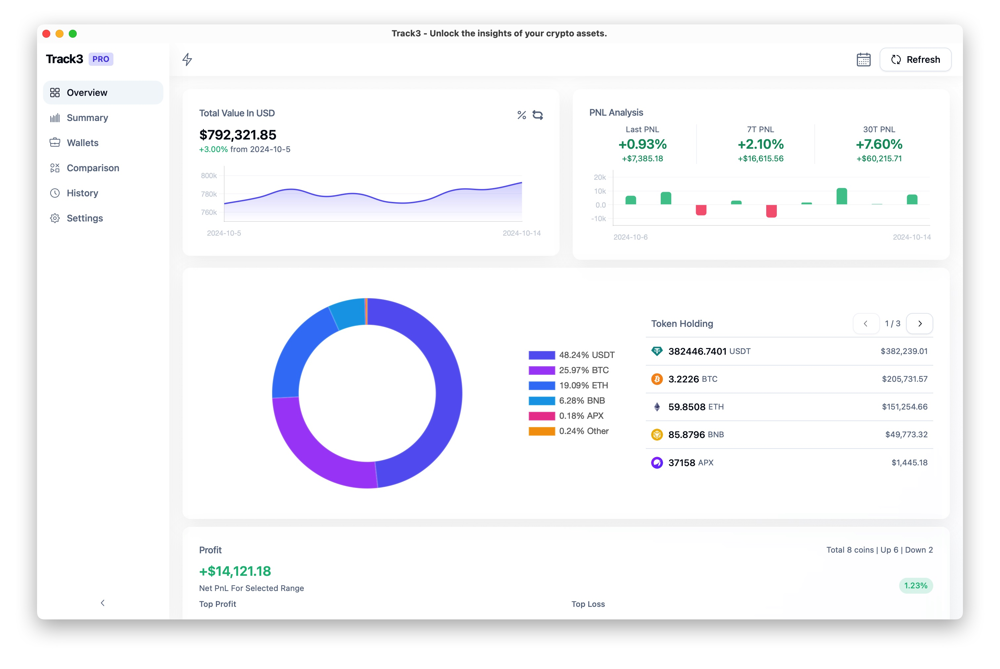
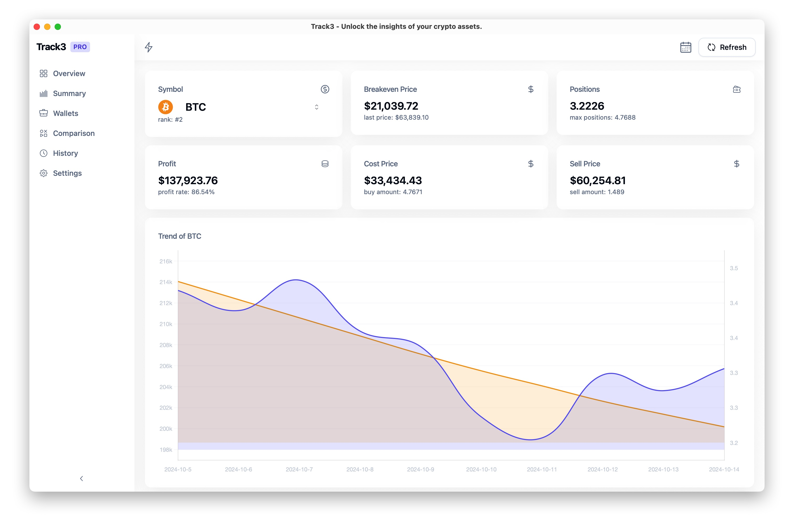
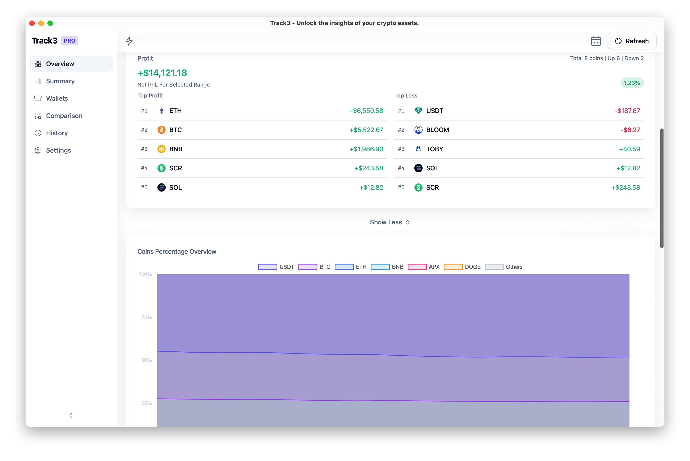
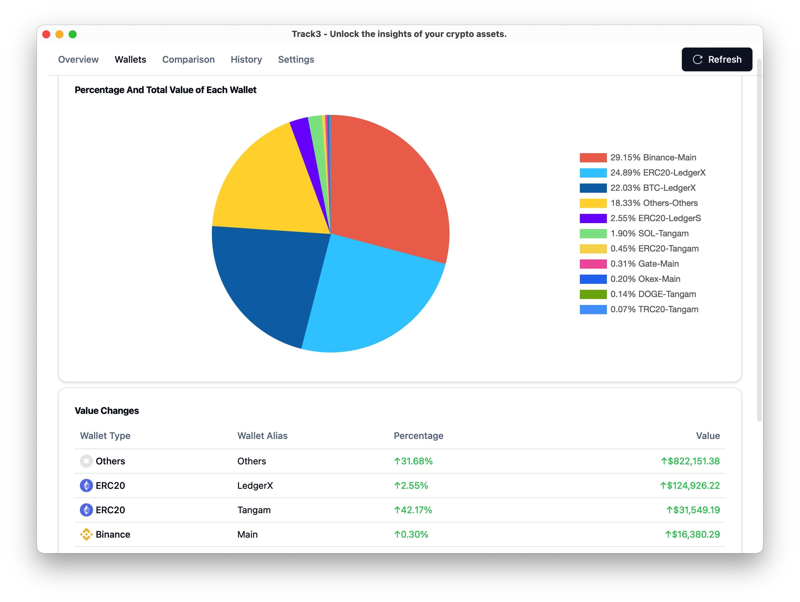
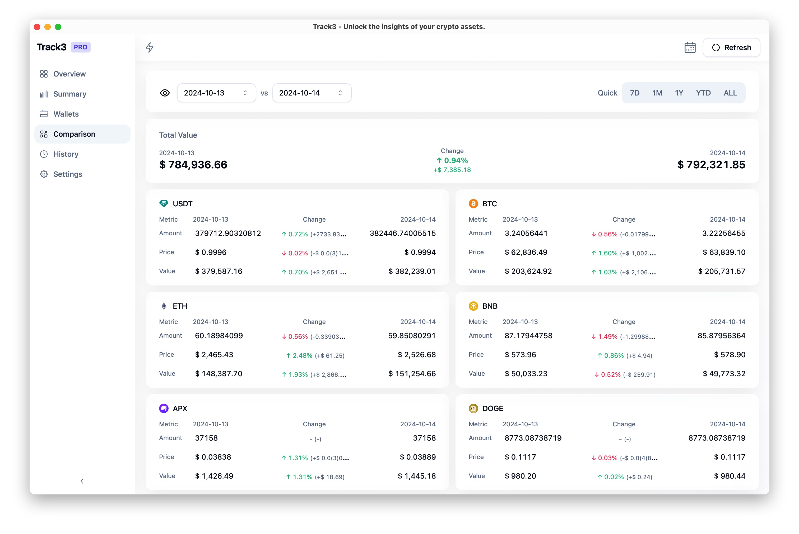
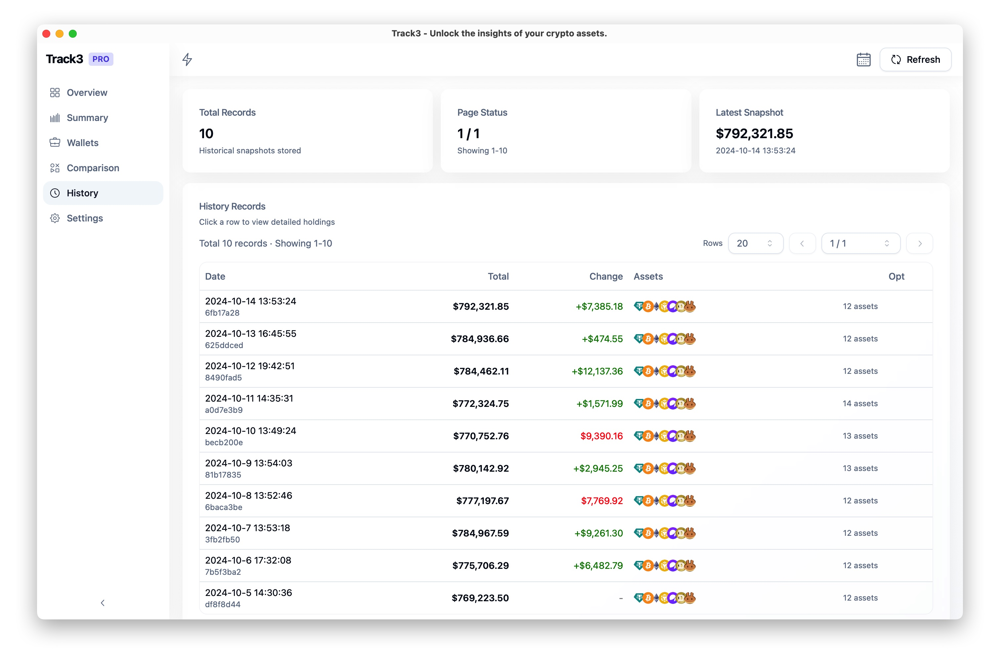
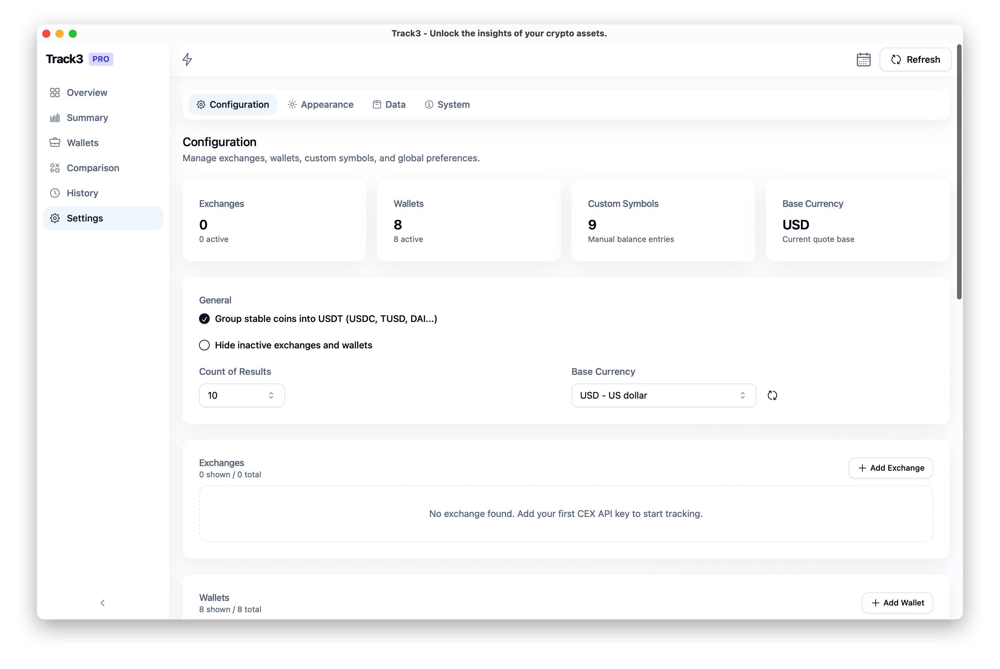

<p align="center">
    
</p>

<h1 align="center">Track3</h1>

<div align="center">

### Analyze your crypto assets on centralized exchanges and web3 wallets

[![author][author-image]][author-url]
[![license][license-image]][license-url]
[![release][release-image]][release-url]
[![last commit][last-commit-image]][last-commit-url]

[author-image]: https://img.shields.io/badge/author-domechn-blue.svg
[author-url]: https://github.com/domechn
[license-image]: https://img.shields.io/github/license/domechn/track3?color=blue
[license-url]: https://github.com/domechn/track3/blob/main/LICENSE
[release-image]: https://img.shields.io/github/v/release/domechn/track3?color=blue
[release-url]: https://github.com/domechn/track3/releases/latest
[last-commit-image]: https://img.shields.io/github/last-commit/domechn/track3?label=last%20commit
[last-commit-url]: https://github.com/domechn/track3/commits

</div>

## Features

1. **No wallet signature required. No backend server, all data is stored locally by default**
2. Support Binance, OKX, Bitget, Kraken and Gate.io. How to create api key ( **Readonly access is enough** ): [Binance](https://www.binance.com/en-BH/support/faq/how-to-create-api-360002502072), [OKX](https://use.autoview.com/hc/en-us/articles/360004576632-OKEx-Creating-an-API), [Gate.io](https://www.gate.io/help/guide/common/17521/how-to-utilize-api)
3. Support BTC, ETH, BNB, SOL and Doge ( Base Users ).
4. Support dozens of charts to analyze data such as wallet proportion, proportion of each currency asset, changes, etc.
5. Support Data backup and restore. Users can export data to local files and import them to other devices, or share them between multi devices by cloud drive ( e.g. iCloud ).

## Pro Users

[How to become pro user for free?](https://track3.notion.site/How-to-get-license-key-by-free-a5e0e39614f54a06ab19ca5aaed58404?pvs=4)

1. Support 15+ EVM compatible Chains: Ethereum, BSC, Polygon, Fantom, Arbitrum, Avalanche, Gnosis, Celo, OKC, Cronos, Optimism, Cardano, Terra 2.0, Cosmos, Osmosis, Base. And Most ERC20 Tokens on these chains.

## Installation

[Download In Release Page](https://github.com/domechn/track3/releases)

## Screenshots









### Notice

**All your data is private, only you can access it. And track3 will never sync your configurations into cloud, they are always stored locally with encryption. So your wallet addresses and api keys are totally safe.**

## Sponsor

- Use this [referral link](https://accounts.binance.com/register?ref=123810997) to register on Binance, both you and i will get 20% discount on trading fees or reward.
- Use this [referral link](https://www.okx.com/join/7161626) to register on OKX, both you and i will get mystery boxes.
- Use this [referral link](https://www.gate.io/signup/UAdFU18N?ref_type=103) to register on Gate.io, you will get 10% discount on trading fees or reward.

## Thanks

Thanks for these platform who provide powerful APIs without API Key. Fuck API Key.

- https://blockchain.info
- https://blockcypher.com
- https://ankr.com
- https://helius-rpc.com
- https://coingecko.com
- https://solana.com

# Note

1. If the following error occurs when you open the app for the first time on `Mac`, please execute this command `xattr -cr /Applications/track3.app/` to fix it.

```text
“track3” is damaged and can’t be opened. You should move it to the Trash.
```
