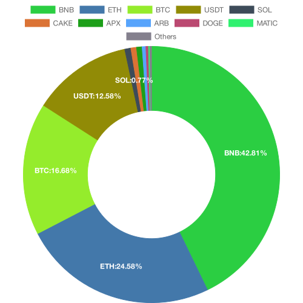

# Asset Statistics

Show your crypto currency assets in centralized exchanges and web3 wallets.

## Features

1. Support all CEX supported by [cctx](https://github.com/ccxt/ccxt)

## Configuration

See Details in [config.example.yaml](./config.example.yaml).

## Usage

```shell
yarn

yarn build

yarn gen
```

## Output



## Thanks

Thanks for these platform who provide powerful APIs without API Key. Fuck API Key.

- https://blockchain.info
- https://dogechain.info
- https://debank.com
- https://solscan.io/
- https://www.coingecko.com/
